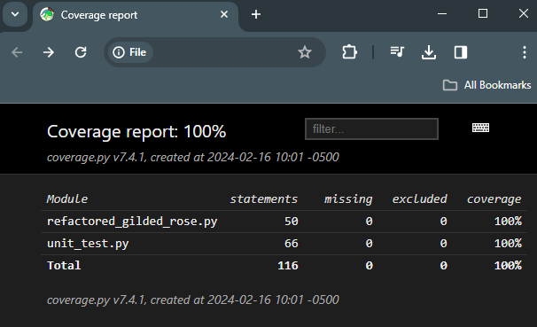
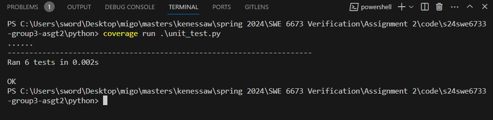

# s24swe6733
Group Assignment for SWE 6733 Spring 2024

Gilded Rose is a small inn with and it has inventory of items that needs to update with its quality as it goes with sell in date. This mob programming is to learn how to refactor this code with testing.
For this Assignment we have used following tools,

# Tools
1. Teams - Communication tool for screen sharing and recording our session. We used this tool throughout the assignment to share our work in progress status and updates.
2. Visual Studio - We used visual studio as IDE for programming the code solution
3. Github - We used Github as our code repository
4. Python - We choose python as our programming language

# Video recordings of mob programming
This video recordings covers multiple sessions in which we brainstormed which programming language to use and how it works. We discussed the requirement and development strategy and test scenarios.
We refactored our code during the session and made changes to it and ran multiple tests and reduced as much code smells.

First session: [click here to see recording on vimeo](https://vimeo.com/913707923)

Second session: [click here to see recording on vimeo](https://vimeo.com/913708064)

# Code Coverage

# Unit Testing

Unit test cases are run using python unit test module. Test cases are in the file unit_test.py. we successfully ran 5 test cases for each item.

# TDD

We followed test driven development by adding new terms and conjured items, tested how the sell_in and quality values changed for each scenario and made changes to the code.